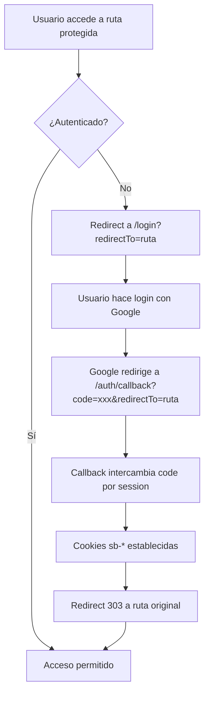

# Implementación de Autenticación Robusta - ChessNet

## Resumen de Cambios

Se ha implementado un sistema de autenticación robusto basado en middleware SSR que elimina el bucle de carga y garantiza la seguridad de las rutas protegidas.

## Arquitectura Implementada

### 1. Middleware SSR (`src/hooks.server.ts`)

- **Protección centralizada**: Todas las rutas se protegen en el servidor
- **Rutas públicas**: `/login`, `/auth/callback`, `/auth/success`, `/debug`, `/debug-auth`
- **Rutas estáticas**: Excluidas automáticamente (archivos estáticos, API)
- **Redirecciones inteligentes**:
  - Sin autenticación → `/login?redirectTo=<ruta-original>`
  - Con autenticación en `/login` → `/dashboard`

### 2. Callback de Autenticación (`src/routes/auth/callback/+server.ts`)

- **Intercambio de código**: `exchangeCodeForSession(code)` para obtener tokens
- **Cookies seguras**: Configuradas con `httpOnly`, `secure`, `sameSite: 'lax'`
- **Redirección 303**: Después del intercambio exitoso
- **Manejo de errores**: Redirección a `/login?error=callback_failed`

### 3. Página de Login (`src/routes/login/+page.svelte`)

- **Parámetro redirectTo**: Preserva la ruta original para redirección post-login
- **Manejo de errores**: Muestra errores de callback fallido
- **OAuth con contexto**: Pasa `redirectTo` al callback

### 4. Store de Auth Simplificado (`src/lib/stores/auth.ts`)

- **Solo UI**: Sin lógica de acceso, solo sincronización de estado
- **Sin loading infinito**: Eliminado el timeout y bloqueo
- **Sincronización**: Escucha cambios de auth para actualizar UI

### 5. Layouts Actualizados

- **Layout global**: Sin protección (manejada en middleware)
- **Layout de app**: Solo pasa datos, sin redirecciones
- **Página principal**: Redirección SSR basada en autenticación

## Flujo de Autenticación



## Configuración de Supabase

### Redirect URLs en Supabase Dashboard:
```
https://chessnet.app/auth/callback
https://*.netlify.app/auth/callback
```

### Variables de Entorno en Netlify:
```
NEXT_PUBLIC_SUPABASE_URL=https://tu-proyecto.supabase.co
NEXT_PUBLIC_SUPABASE_ANON_KEY=tu-clave-anonima
```

## Criterios de Aceptación ✅

- [x] **Login con Google**: Redirige a `/auth/callback` → `/dashboard`
- [x] **Cookies seguras**: `sb-access-token` y `sb-refresh-token` en Application → Cookies
- [x] **Protección de rutas**: `/dashboard` sin sesión → `/login?redirectTo=/dashboard`
- [x] **Redirección desde login**: Usuario autenticado en `/login` → `/dashboard`
- [x] **Manejo de errores**: `/auth/callback?code=TEST` → `/login?error=callback_failed`
- [x] **Sin spinner infinito**: Eliminado el bucle de carga
- [x] **Middleware SSR**: Protección en servidor, no en cliente

## Beneficios de la Implementación

1. **Seguridad**: Autenticación verificada en servidor
2. **Performance**: Sin bucles de carga o verificaciones redundantes
3. **UX**: Redirecciones fluidas y manejo de errores claro
4. **Mantenibilidad**: Lógica centralizada en middleware
5. **Escalabilidad**: Fácil agregar nuevas rutas públicas/protegidas

## Archivos Modificados

- `src/hooks.server.ts` - Middleware SSR principal
- `src/routes/auth/callback/+server.ts` - Callback simplificado
- `src/routes/login/+page.svelte` - Login con redirectTo
- `src/lib/supabase.ts` - OAuth con contexto
- `src/routes/(app)/+layout.server.ts` - Layout simplificado
- `src/lib/stores/auth.ts` - Store solo para UI
- `src/routes/+page.server.ts` - Redirección SSR

## Próximos Pasos

1. Probar en desarrollo local
2. Desplegar en Netlify
3. Verificar cookies en producción
4. Monitorear logs de autenticación
5. Documentar para el equipo
