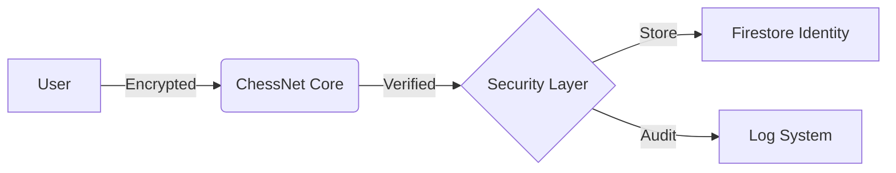

<LegalLayout {title} {subtitle} {updatedDate} icon={Shield}>

## 1. Information Sovereignty
At ChessNet, we believe your data is your most valuable asset. We only collect what is strictly necessary to provide an elite educational experience.

### Identity Data
- Full Name (for school records)
- Email Address (for authentication)
- Lichess/Chess.com IDs (for performance tracking)

### Operational Data
- Class attendance and historical performance.
- Skill development progress and achievements.
- Internal financial transactions (tuition, scholarship credits).

## 2. Encryption & Defense
Your data is protected by the highest standards of the Firebase Security stack.
- **End-to-End Encryption:** All transit data uses TLS 1.3.
- **Granular Access Control:** Only authorized instructors can access student records.
- **Biometric Ready:** Our architecture supports the latest web-auth standards.

## 3. Data Flow

## 4. Your Rights (GDPR/LOPD)
You maintain the right to:
1. **Access** your complete dataset.
2. **Rectify** any inaccuracies.
3. **Erase** your digital footprint ("Right to be Forgotten").
4. **Export** your data in JSON format.

---

### Integrity Commitment
We do not sell, rent, or trade your data with third-party advertising entities. Your progress is personal.

**DPO Contact:** [chessnetappweb@gmail.com](mailto:chessnetappweb@gmail.com)

</LegalLayout>
